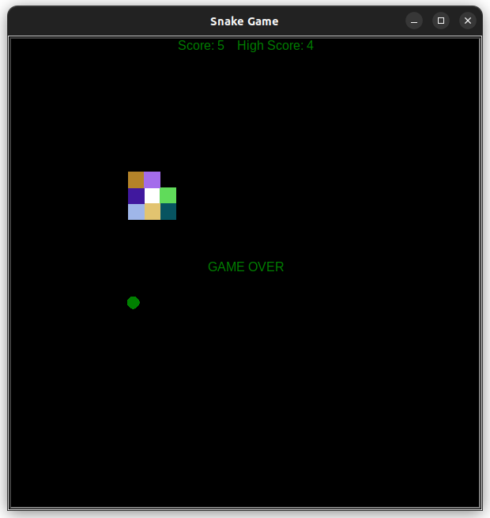

# Snake Game in Python

## Tejas Acharya
## [Twitter](https://twitter.com/achte_te)

## Snake grows longer everytime it eats food and score gets updated.
## Game is over when snake hits wall(boundary).
## Game is over when snake bites it's own body.

### Game Screen

### GAME OVER screen when snake hits wall.

### GAME OVER screen when snake bites it's own body.
