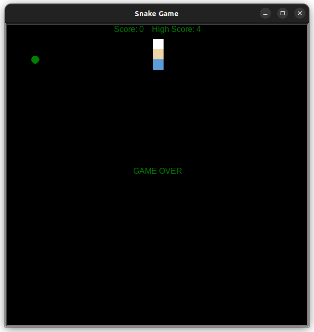

# Snake Game in Python

Tejas Acharya
[Twitter](https://twitter.com/achte_te)

Snake grows longer everytime it eats food and score gets updated. Game is over when snake hits wall(boundary) or when snake bites it's own body. Snake is controlled by Arrow keys.


### Requirements:
[Turtle](https://docs.python.org/3/library/turtle.html)


To Run:
```sh
git clone git@github.com:achte-2022/Snake-Game.git
cd Snake-Game
python3 main.py
```

### Game Screen


### GAME OVER screen when snake hits wall.


### GAME OVER screen when snake bites it's own body.

